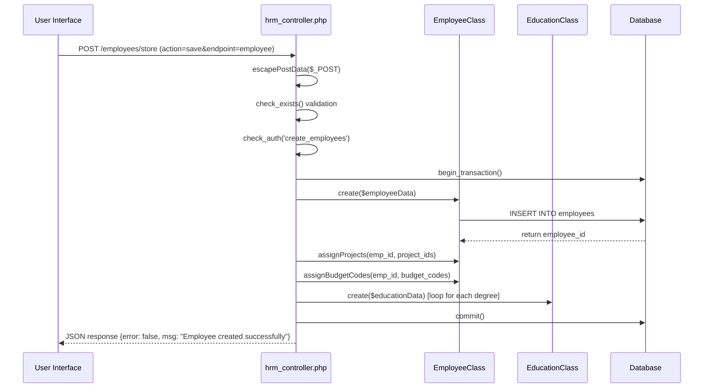
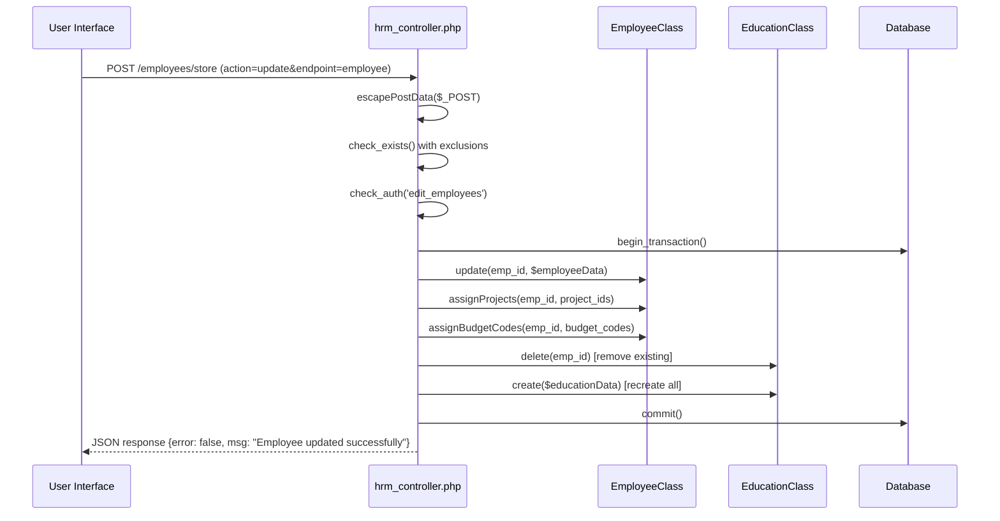
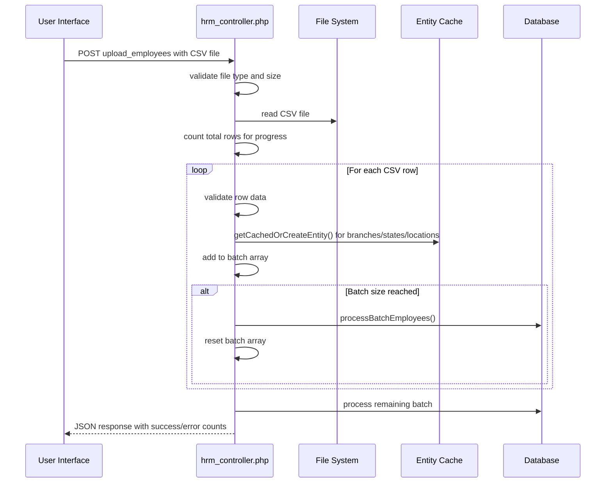
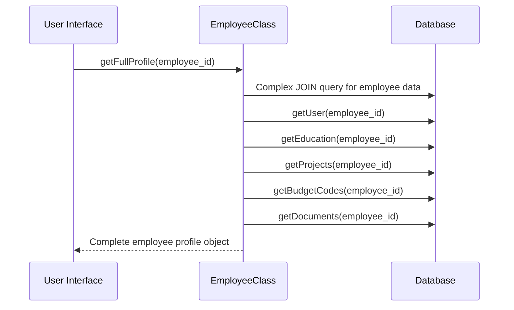
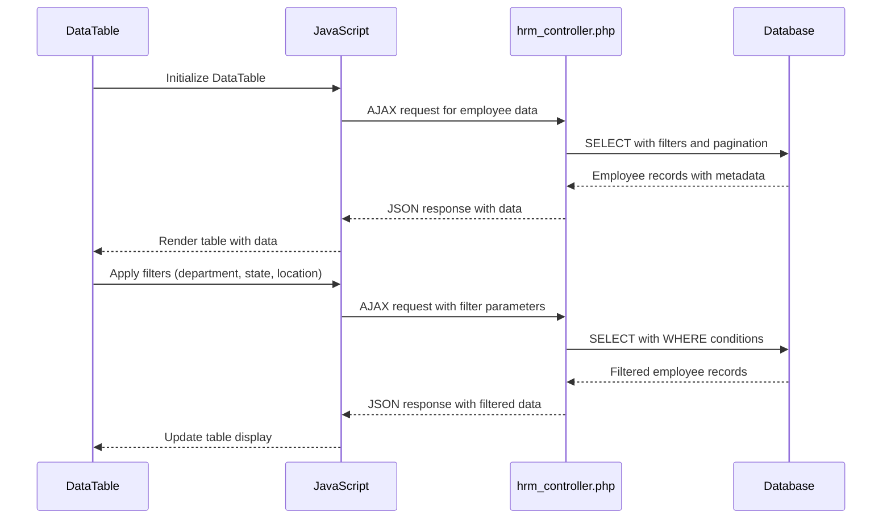
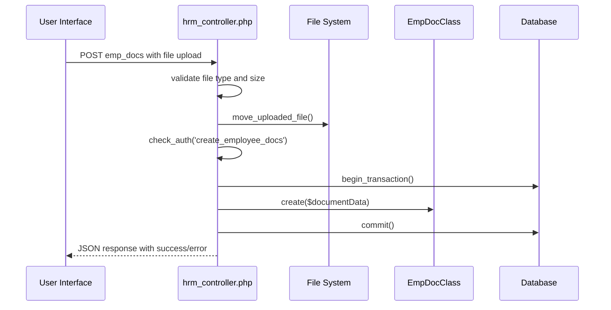
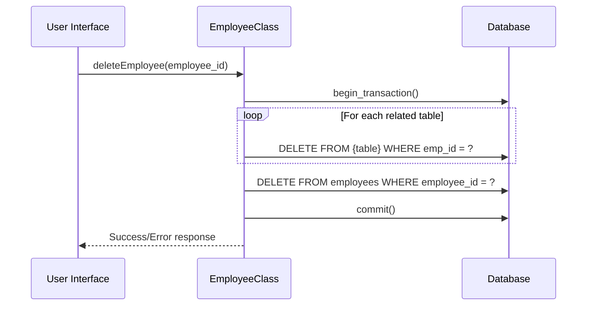

# Employee Management Workflows

## Overview

This document describes the technical workflows and processes for employee management operations in the HRM application. Each workflow traces the complete path from user interface interactions to database operations, including validation, business logic, and integration points.

## 1. Employee Creation Workflow

### User Interface Flow

1. **Navigation**: User accesses `/employees/add` endpoint
2. **Form Display**: System renders tabbed employee creation form with four sections:
   - Employee Info (personal details)
   - Organization (branch, location, projects)
   - Contract Info (employment terms)
   - Education (academic history)

### Data Submission Process



### Technical Implementation Details

#### Data Processing Steps:
1. **Input Sanitization**: All POST data is sanitized using `escapePostData()`
2. **Data Separation**: Employee data is separated from education and relationship data
3. **Validation**: System checks for duplicate employees and user permissions
4. **Transaction Management**: Database transaction ensures data consistency

#### Key Code Components:

**Employee Data Preparation**:
```php
$employeeData = $post;
unset($employeeData['degree']);
unset($employeeData['institution']);
unset($employeeData['startYear']);
unset($employeeData['endYear']);
unset($employeeData['project']);
unset($employeeData['project_id']);
unset($employeeData['budget_code']);

$data['added_by'] = $_SESSION['user_id'];
```

**Staff Number Generation**:
```php
if(!isset($post['staff_no']) || $post['staff_no'] == return_setting('staff_prefix')) {
    $staff_no = return_setting('staff_prefix').$result['id'];
    $staffNo = array('staff_no' => $staff_no);
    $employeeClass->update($result['id'], $staffNo);
}
```

**Project Assignment**:
```php
if(isset($post['project_id']) && is_array($post['project_id'])) {
    $employeeClass->assignProjects($emp_id, $post['project_id']);
}
```

**Education Records Creation**:
```php
if (is_array($degree) && count($degree) > 0) {
    foreach ($degree as $index => $value) {
        $educationData = array(
            'employee_id'      => $result['id'],
            'degree'           => escapeStr($degree[$index]),
            'institution'      => escapeStr($institution[$index]),
            'start_year'       => escapeStr($startYear[$index]),
            'graduation_year'  => escapeStr($endYear[$index]),
        );
        $educationClass->create($educationData);
    }
}
```

### Error Handling

- **Database Rollback**: Automatic transaction rollback on any error
- **Validation Errors**: Detailed error messages for validation failures
- **Exception Handling**: Comprehensive exception catching and logging
- **User Feedback**: JSON response with error status and descriptive messages

## 2. Employee Update Workflow

### User Interface Flow

1. **Employee Selection**: User navigates to `/employees/edit/{employee_id}`
2. **Data Loading**: System loads existing employee data using `getFullProfile()`
3. **Form Population**: Pre-populate form fields with current employee data
4. **Data Modification**: User updates required fields across tabs
5. **Submission**: Form submits to update endpoint

### Data Update Process



### Technical Implementation Details

#### Update Strategy:
- **Selective Updates**: Only employee table data is updated directly
- **Relationship Replacement**: Projects and budget codes are completely replaced
- **Education Rebuild**: All education records are deleted and recreated
- **Audit Trail**: Update timestamp and user tracking

#### Key Code Components:

**Data Preparation for Update**:
```php
$employeeData = $post;
unset(
    $employeeData['employee_id'],
    $employeeData['degree'],
    $employeeData['institution'],
    $employeeData['startYear'],
    $employeeData['endYear'],
    $employeeData['project'],
    $employeeData['project_id'],
    $employeeData['budget_code']
);

$employeeData['updated_by']   = $_SESSION['user_id'];
$employeeData['updated_date'] = date('Y-m-d H:i:s');
```

**Project Synchronization**:
```php
$projectIds = isset($post['project_id']) && is_array($post['project_id'])
    ? array_map('intval', $post['project_id'])
    : [];

$employeeClass->assignProjects($empId, $projectIds);
```

**Education Synchronization**:
```php
$educationClass->delete($empId);   // Remove all existing rows

$degrees      = $post['degree']      ?? [];
$institutions = $post['institution'] ?? [];
$startYears   = $post['startYear']   ?? [];
$endYears     = $post['endYear']     ?? [];

if (is_array($degrees) && count($degrees)) {
    foreach ($degrees as $idx => $deg) {
        $educationClass->create([
            'employee_id'     => $empId,
            'degree'          => escapeStr($deg),
            'institution'     => escapeStr($institutions[$idx] ?? ''),
            'start_year'      => escapeStr($startYears[$idx]  ?? ''),
            'graduation_year' => escapeStr($endYears[$idx]    ?? ''),
        ]);
    }
}
```

## 3. Bulk Employee Import Workflow

### File Upload and Processing



### Technical Implementation Details

#### Batch Processing Strategy:
- **File Validation**: Check file type, size, and format
- **Progress Tracking**: Count total rows for progress calculation
- **Batch Processing**: Process employees in batches of 50 for performance
- **Entity Caching**: Cache organizational entities to reduce database queries
- **Error Collection**: Collect and report all processing errors

#### Key Code Components:

**File Validation**:
```php
if ($fileType != 'text/csv') {
    $result['error'] = true;
    $result['msg'] = "Invalid file type. Please upload a valid CSV file.";
    echo json_encode($result);
    exit();
}
```

**Entity Caching Function**:
```php
function getCachedOrCreateEntity($table, $name, $userId, $class, &$cache) {
    if (!isset($cache[$table][$name])) {
        // Check if entity exists
        $existing = $class->where(['name' => $name]);
        if ($existing) {
            $cache[$table][$name] = $existing[0]['id'];
        } else {
            // Create new entity
            $id = $class->create(['name' => $name, 'added_by' => $userId]);
            $cache[$table][$name] = $id;
        }
    }
    return $cache[$table][$name];
}
```

**Batch Processing**:
```php
if (count($batchData) >= $batchSize) {
    $batchResult = processBatchEmployees($batchData, $employeeClass, $myUserId);
    $successCount += $batchResult['success'];
    $errorCount += $batchResult['errors'];
    if (!empty($batchResult['error_messages'])) {
        $result['errors'] .= $batchResult['error_messages'];
    }
    $batchData = [];
}
```

## 4. Employee Data Retrieval Workflows

### Single Employee Profile Loading



#### Key SQL Query:
```sql
SELECT 
    e.*,
    s.name AS state_name,
    s.country_name,
    l.name AS location_name,
    l.city_name AS location_city,
    b.name AS branch_name,
    b.address AS branch_address,
    b.contact_email AS branch_email,
    b.contact_phone AS branch_phone,
    GROUP_CONCAT(DISTINCT p.name ORDER BY p.name SEPARATOR ", ") AS projects,
    GROUP_CONCAT(DISTINCT bc.name ORDER BY bc.name SEPARATOR ", ") AS budget_codes
FROM employees e
LEFT JOIN states s ON s.id = e.state_id
LEFT JOIN locations l ON l.id = e.location_id
LEFT JOIN branches b ON b.id = e.branch_id
LEFT JOIN employee_projects ep ON ep.emp_id = e.employee_id
LEFT JOIN projects p ON p.id = ep.project_id
LEFT JOIN employee_budget_codes ebc ON ebc.emp_id = e.employee_id
LEFT JOIN budget_codes bc ON bc.id = ebc.code_id
WHERE e.employee_id = ?
GROUP BY e.employee_id
```

### Employee List with Filtering



## 5. Employee Document Management Workflow

### Document Upload Process



### Technical Implementation Details

#### File Upload Validation:
```php
$target_dir = '../assets/docs/employee/';
if (!file_exists($target_dir)) {
    mkdir($target_dir, 0777, true);
}

$file = $_FILES['docFile'];
$file_ext = strtolower(pathinfo($file['name'], PATHINFO_EXTENSION));
$file_name = uniqid() . '.' . $file_ext;
$target_file = $target_dir . $file_name;

if (move_uploaded_file($file['tmp_name'], $target_file)) {
    // Process document data
}
```

#### Document Data Structure:
```php
$data = array(
    'name' => $post['docName'],
    'folder_id' => $post['docFolder'],
    'folder_name' => $post['docFolderName'],
    'type_id' => $post['docType'],
    'type_name' => $post['docTypeName'],
    'emp_id' => $post['employee_id'],
    'full_name' => $employeeInfo['full_name'],
    'phone' => $employeeInfo['phone'],
    'email' => $employeeInfo['email'],
    'expiration_date' => $post['expirationDate'],
    'document' => $file_name,
    'created_by' => $_SESSION['user_id'],
    'updated_by' => $_SESSION['user_id']
);
```

## 6. Employee Deletion Workflow

### Cascade Deletion Process



### Technical Implementation Details

#### Related Tables Cleanup:
```php
$tables = [
    'atten_details',
    'employee_budget_codes',
    'employee_docs',
    'employee_leave',
    'employee_performance',
    'employee_projects',
    'employee_transactions',
    'payroll_details',
    'training_list'
];

try {
    $GLOBALS['conn']->begin_transaction();
    
    foreach ($tables as $table) {
        $this->runQuery(
            "DELETE FROM {$table} WHERE emp_id = ?",
            [$employeeId],
            'i'
        );
    }
    
    $this->runQuery(
        "DELETE FROM employees WHERE employee_id = ?",
        [$employeeId],
        'i'
    );
    
    $GLOBALS['conn']->commit();
    return true;
} catch (Exception $e) {
    $GLOBALS['conn']->rollback();
    throw new Exception("Error deleting employee: " . $e->getMessage());
}
```

## 7. Integration Workflows

### Payroll Integration

When employee data changes, the system automatically updates related payroll information:

1. **Salary Changes**: Update base salary in payroll calculations
2. **Bank Account Changes**: Update payment destination for future payrolls
3. **Status Changes**: Exclude inactive employees from payroll processing
4. **Organizational Changes**: Update cost center allocations

### Attendance Integration

Employee data integrates with attendance tracking:

1. **Work Schedule**: Use work_days and work_hours for attendance calculations
2. **Location Tracking**: Validate attendance against assigned locations
3. **Project Time**: Link timesheet entries to assigned projects
4. **Leave Balance**: Calculate available leave based on employment terms

### User Account Integration

Employee records synchronize with user accounts:

1. **Account Creation**: Automatically create user accounts for new employees
2. **Profile Updates**: Sync changes to name, email, and contact information
3. **Access Control**: Update permissions based on role and status changes
4. **Password Management**: Handle password resets and security updates

## Error Handling and Validation

### Data Validation Rules

1. **Required Fields**: Enforce mandatory fields at application level
2. **Format Validation**: Validate email, phone, and date formats
3. **Business Rules**: Enforce unique staff numbers and email addresses
4. **Referential Integrity**: Validate foreign key relationships
5. **File Validation**: Check file types, sizes, and security constraints

### Error Response Format

```json
{
    "error": true,
    "msg": "User-friendly error message",
    "sql_error": "Technical error details",
    "validation_errors": {
        "field_name": "Specific field error message"
    }
}
```

### Transaction Management

All critical operations use database transactions to ensure data consistency:

- **Automatic Rollback**: Any error triggers complete transaction rollback
- **Isolation Levels**: Appropriate isolation levels for concurrent operations
- **Deadlock Handling**: Retry logic for deadlock situations
- **Audit Logging**: Complete audit trail of all changes