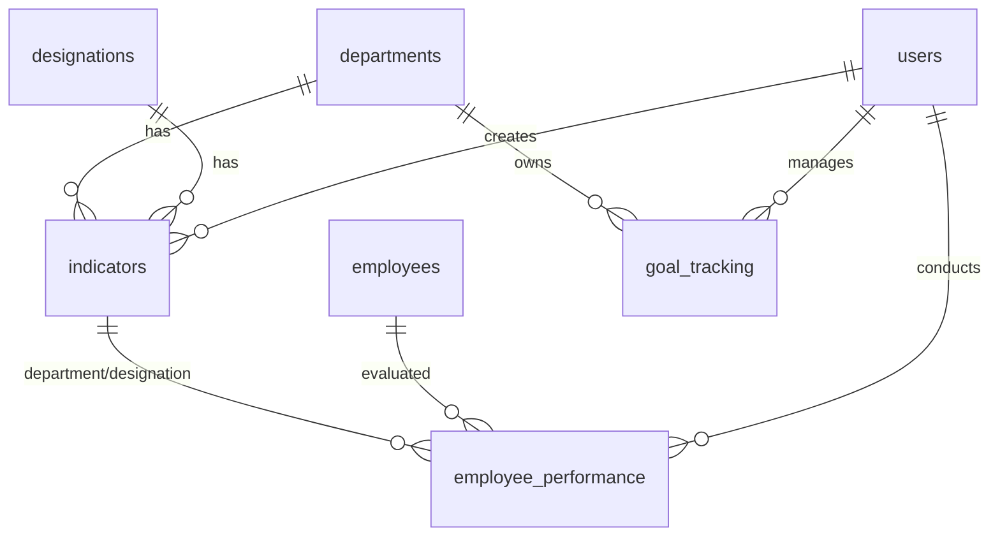
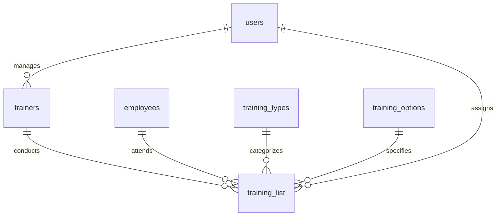

# Performance and Training Database Schema

## Overview

This document provides comprehensive documentation of the database schema for the Performance Management and Training systems within the HRM application. The schema includes tables for performance indicators, employee appraisals, goal tracking, trainer management, and training program assignments.

## Performance Management Tables

### 1. indicators Table

**Purpose**: Stores performance indicators for different departments and designations with competency-based evaluation criteria.

```sql
CREATE TABLE indicators (
    id INT PRIMARY KEY AUTO_INCREMENT,
    department_id INT,
    designation_id INT,
    department VARCHAR(255),
    designation VARCHAR(255),
    attributes JSON,
    added_by INT,
    added_date TIMESTAMP DEFAULT CURRENT_TIMESTAMP,
    updated_by INT,
    updated_date TIMESTAMP DEFAULT CURRENT_TIMESTAMP ON UPDATE CURRENT_TIMESTAMP,
    
    INDEX idx_department_id (department_id),
    INDEX idx_designation_id (designation_id),
    INDEX idx_added_by (added_by),
    INDEX idx_department_designation (department_id, designation_id)
);
```

#### Field Descriptions

| Field | Type | Description | Constraints |
|-------|------|-------------|-------------|
| id | INT | Primary key, auto-incrementing | NOT NULL, AUTO_INCREMENT |
| department_id | INT | Foreign key to departments table | References departments.id |
| designation_id | INT | Foreign key to designations table | References designations.id |
| department | VARCHAR(255) | Department name (denormalized) | For performance and historical data |
| designation | VARCHAR(255) | Designation name (denormalized) | For performance and historical data |
| attributes | JSON | Competency ratings and criteria | Stores structured competency data |
| added_by | INT | User ID who created the record | References users.id |
| added_date | TIMESTAMP | Record creation timestamp | DEFAULT CURRENT_TIMESTAMP |
| updated_by | INT | User ID who last updated the record | References users.id |
| updated_date | TIMESTAMP | Last update timestamp | ON UPDATE CURRENT_TIMESTAMP |

#### Attributes JSON Structure

The `attributes` field stores competency data in the following JSON format:

```json
{
  "Behavioural Competencies": [
    {"name": "Business Process", "rating": 4},
    {"name": "Oral Communication", "rating": 3},
    {"name": "Written Communication", "rating": 4},
    {"name": "Teamwork", "rating": 5},
    {"name": "Customer Service", "rating": 3}
  ],
  "Organizational Competencies": [
    {"name": "Leadership", "rating": 3},
    {"name": "Project Management", "rating": 4},
    {"name": "Strategic Thinking", "rating": 3},
    {"name": "Decision Making", "rating": 4}
  ],
  "Technical Competencies": [
    {"name": "Allocating Resources", "rating": 4},
    {"name": "Technical Expertise", "rating": 5},
    {"name": "Problem Solving", "rating": 4},
    {"name": "Innovation", "rating": 3}
  ]
}
```

#### Relationships
- **departments**: Many-to-one relationship with departments table
- **designations**: Many-to-one relationship with designations table
- **users**: Many-to-one relationship with users table (for audit trail)

### 2. employee_performance Table

**Purpose**: Stores individual employee performance appraisals with ratings and evaluation details.

```sql
CREATE TABLE employee_performance (
    id INT PRIMARY KEY AUTO_INCREMENT,
    emp_id INT NOT NULL,
    full_name VARCHAR(255),
    phone_number VARCHAR(20),
    email VARCHAR(255),
    staff_no VARCHAR(50),
    department_id INT,
    designation_id INT,
    department VARCHAR(255),
    desgination VARCHAR(255), -- Note: Original typo in schema
    indicator_rating DECIMAL(3,2),
    appraisal_rating DECIMAL(3,2),
    month VARCHAR(20),
    remarks TEXT,
    status VARCHAR(20) DEFAULT 'Active',
    added_by INT,
    added_date TIMESTAMP DEFAULT CURRENT_TIMESTAMP,
    updated_by INT,
    updated_date TIMESTAMP DEFAULT CURRENT_TIMESTAMP ON UPDATE CURRENT_TIMESTAMP,
    
    INDEX idx_emp_id (emp_id),
    INDEX idx_department_id (department_id),
    INDEX idx_designation_id (designation_id),
    INDEX idx_status (status),
    INDEX idx_month (month),
    INDEX idx_added_date (added_date),
    INDEX idx_emp_month (emp_id, month)
);
```

#### Field Descriptions

| Field | Type | Description | Constraints |
|-------|------|-------------|-------------|
| id | INT | Primary key, auto-incrementing | NOT NULL, AUTO_INCREMENT |
| emp_id | INT | Foreign key to employees table | NOT NULL, References employees.id |
| full_name | VARCHAR(255) | Employee full name (denormalized) | For performance and reporting |
| phone_number | VARCHAR(20) | Employee phone number (denormalized) | For contact and reporting |
| email | VARCHAR(255) | Employee email address (denormalized) | For contact and reporting |
| staff_no | VARCHAR(50) | Employee staff number (denormalized) | For identification and reporting |
| department_id | INT | Department ID | References departments.id |
| designation_id | INT | Designation ID | References designations.id |
| department | VARCHAR(255) | Department name (denormalized) | For performance and reporting |
| desgination | VARCHAR(255) | Designation name (denormalized) | Note: Contains typo in original |
| indicator_rating | DECIMAL(3,2) | Rating based on performance indicators | Scale 0.00-5.00 |
| appraisal_rating | DECIMAL(3,2) | Overall appraisal rating | Scale 0.00-5.00 |
| month | VARCHAR(20) | Appraisal period/month | Format: "YYYY-MM" or descriptive |
| remarks | TEXT | Appraisal comments and feedback | Free text field |
| status | VARCHAR(20) | Record status | DEFAULT 'Active' |
| added_by | INT | User ID who created the appraisal | References users.id |
| added_date | TIMESTAMP | Appraisal creation timestamp | DEFAULT CURRENT_TIMESTAMP |
| updated_by | INT | User ID who last updated | References users.id |
| updated_date | TIMESTAMP | Last update timestamp | ON UPDATE CURRENT_TIMESTAMP |

#### Relationships
- **employees**: Many-to-one relationship with employees table
- **departments**: Many-to-one relationship with departments table
- **designations**: Many-to-one relationship with designations table
- **indicators**: Logical relationship through department_id and designation_id
- **users**: Many-to-one relationship with users table (for audit trail)

### 3. goal_tracking Table

**Purpose**: Tracks organizational and departmental goals with progress monitoring and status management.

```sql
CREATE TABLE goal_tracking (
    id INT PRIMARY KEY AUTO_INCREMENT,
    department_id INT,
    type_id INT,
    department VARCHAR(255),
    type VARCHAR(255),
    subject VARCHAR(255),
    target TEXT,
    description TEXT,
    start_date DATE,
    end_date DATE,
    progress VARCHAR(255),
    status VARCHAR(50) DEFAULT 'Active',
    added_by INT,
    added_date TIMESTAMP DEFAULT CURRENT_TIMESTAMP,
    updated_by INT,
    updated_date TIMESTAMP DEFAULT CURRENT_TIMESTAMP ON UPDATE CURRENT_TIMESTAMP,
    
    INDEX idx_department_id (department_id),
    INDEX idx_type_id (type_id),
    INDEX idx_status (status),
    INDEX idx_start_date (start_date),
    INDEX idx_end_date (end_date),
    INDEX idx_added_date (added_date),
    INDEX idx_dept_status (department_id, status)
);
```

#### Field Descriptions

| Field | Type | Description | Constraints |
|-------|------|-------------|-------------|
| id | INT | Primary key, auto-incrementing | NOT NULL, AUTO_INCREMENT |
| department_id | INT | Department responsible for goal | References departments.id |
| type_id | INT | Goal type/category ID | References goal_types.id |
| department | VARCHAR(255) | Department name (denormalized) | For performance and reporting |
| type | VARCHAR(255) | Goal type name (denormalized) | For performance and reporting |
| subject | VARCHAR(255) | Goal title/subject | Brief goal description |
| target | TEXT | Specific target or outcome | Detailed target description |
| description | TEXT | Detailed goal description | Complete goal context |
| start_date | DATE | Goal start date | Goal timeline start |
| end_date | DATE | Goal end date | Goal deadline |
| progress | VARCHAR(255) | Current progress status | Progress description or percentage |
| status | VARCHAR(50) | Goal status | DEFAULT 'Active' |
| added_by | INT | User ID who created the goal | References users.id |
| added_date | TIMESTAMP | Goal creation timestamp | DEFAULT CURRENT_TIMESTAMP |
| updated_by | INT | User ID who last updated | References users.id |
| updated_date | TIMESTAMP | Last update timestamp | ON UPDATE CURRENT_TIMESTAMP |

#### Relationships
- **departments**: Many-to-one relationship with departments table
- **goal_types**: Many-to-one relationship with goal types table
- **users**: Many-to-one relationship with users table (for audit trail)

## Training Management Tables

### 4. trainers Table

**Purpose**: Stores trainer/instructor information for training program management.

```sql
CREATE TABLE trainers (
    id INT PRIMARY KEY AUTO_INCREMENT,
    full_name VARCHAR(255) NOT NULL,
    phone VARCHAR(20),
    email VARCHAR(255) UNIQUE,
    status VARCHAR(20) DEFAULT 'Active',
    added_by INT,
    added_date TIMESTAMP DEFAULT CURRENT_TIMESTAMP,
    updated_by INT,
    updated_date TIMESTAMP DEFAULT CURRENT_TIMESTAMP ON UPDATE CURRENT_TIMESTAMP,
    
    UNIQUE KEY uk_email (email),
    INDEX idx_status (status),
    INDEX idx_full_name (full_name),
    INDEX idx_added_by (added_by)
);
```

#### Field Descriptions

| Field | Type | Description | Constraints |
|-------|------|-------------|-------------|
| id | INT | Primary key, auto-incrementing | NOT NULL, AUTO_INCREMENT |
| full_name | VARCHAR(255) | Trainer full name | NOT NULL |
| phone | VARCHAR(20) | Trainer phone number | Contact information |
| email | VARCHAR(255) | Trainer email address | UNIQUE, Contact information |
| status | VARCHAR(20) | Trainer availability status | DEFAULT 'Active' |
| added_by | INT | User ID who registered trainer | References users.id |
| added_date | TIMESTAMP | Trainer registration timestamp | DEFAULT CURRENT_TIMESTAMP |
| updated_by | INT | User ID who last updated | References users.id |
| updated_date | TIMESTAMP | Last update timestamp | ON UPDATE CURRENT_TIMESTAMP |

#### Relationships
- **training_list**: One-to-many relationship with training assignments
- **users**: Many-to-one relationship with users table (for audit trail)

### 5. training_list Table

**Purpose**: Stores training program assignments with employee, trainer, and program details.

```sql
CREATE TABLE training_list (
    id INT PRIMARY KEY AUTO_INCREMENT,
    type_id INT,
    type_name VARCHAR(255),
    option_id INT,
    option_name VARCHAR(255),
    trainer_id INT,
    trainer_name VARCHAR(255),
    trainer_phone VARCHAR(20),
    trainer_email VARCHAR(255),
    emp_id INT NOT NULL,
    full_name VARCHAR(255),
    phone_number VARCHAR(20),
    email VARCHAR(255),
    staff_no VARCHAR(50),
    cost DECIMAL(10,2),
    start_date DATE,
    end_date DATE,
    description TEXT,
    status VARCHAR(50) DEFAULT 'Active',
    added_by INT,
    added_date TIMESTAMP DEFAULT CURRENT_TIMESTAMP,
    updated_by INT,
    updated_date TIMESTAMP DEFAULT CURRENT_TIMESTAMP ON UPDATE CURRENT_TIMESTAMP,
    
    INDEX idx_emp_id (emp_id),
    INDEX idx_trainer_id (trainer_id),
    INDEX idx_type_id (type_id),
    INDEX idx_option_id (option_id),
    INDEX idx_status (status),
    INDEX idx_start_date (start_date),
    INDEX idx_end_date (end_date),
    INDEX idx_emp_status (emp_id, status),
    INDEX idx_trainer_status (trainer_id, status)
);
```

#### Field Descriptions

| Field | Type | Description | Constraints |
|-------|------|-------------|-------------|
| id | INT | Primary key, auto-incrementing | NOT NULL, AUTO_INCREMENT |
| type_id | INT | Training type ID | References training_types.id |
| type_name | VARCHAR(255) | Training type name (denormalized) | For performance and reporting |
| option_id | INT | Training option ID | References training_options.id |
| option_name | VARCHAR(255) | Training option name (denormalized) | For performance and reporting |
| trainer_id | INT | Trainer ID | References trainers.id |
| trainer_name | VARCHAR(255) | Trainer name (denormalized) | For performance and reporting |
| trainer_phone | VARCHAR(20) | Trainer phone (denormalized) | For contact and reporting |
| trainer_email | VARCHAR(255) | Trainer email (denormalized) | For contact and reporting |
| emp_id | INT | Employee ID | NOT NULL, References employees.id |
| full_name | VARCHAR(255) | Employee name (denormalized) | For performance and reporting |
| phone_number | VARCHAR(20) | Employee phone (denormalized) | For contact and reporting |
| email | VARCHAR(255) | Employee email (denormalized) | For contact and reporting |
| staff_no | VARCHAR(50) | Employee staff number (denormalized) | For identification and reporting |
| cost | DECIMAL(10,2) | Training cost | Financial tracking |
| start_date | DATE | Training start date | Schedule management |
| end_date | DATE | Training end date | Schedule management |
| description | TEXT | Training description | Program details |
| status | VARCHAR(50) | Training status | DEFAULT 'Active' |
| added_by | INT | User ID who created assignment | References users.id |
| added_date | TIMESTAMP | Assignment creation timestamp | DEFAULT CURRENT_TIMESTAMP |
| updated_by | INT | User ID who last updated | References users.id |
| updated_date | TIMESTAMP | Last update timestamp | ON UPDATE CURRENT_TIMESTAMP |

#### Relationships
- **employees**: Many-to-one relationship with employees table
- **trainers**: Many-to-one relationship with trainers table
- **training_types**: Many-to-one relationship with training types table
- **training_options**: Many-to-one relationship with training options table
- **users**: Many-to-one relationship with users table (for audit trail)

### 6. training_types Table

**Purpose**: Defines categories of training programs.

```sql
CREATE TABLE training_types (
    id INT PRIMARY KEY AUTO_INCREMENT,
    name VARCHAR(255) NOT NULL,
    status VARCHAR(20) DEFAULT 'active',
    
    INDEX idx_status (status),
    INDEX idx_name (name)
);
```

#### Field Descriptions

| Field | Type | Description | Constraints |
|-------|------|-------------|-------------|
| id | INT | Primary key, auto-incrementing | NOT NULL, AUTO_INCREMENT |
| name | VARCHAR(255) | Training type name | NOT NULL |
| status | VARCHAR(20) | Type availability status | DEFAULT 'active' |

#### Relationships
- **training_list**: One-to-many relationship with training assignments
- **training_options**: One-to-many relationship with training options

### 7. training_options Table

**Purpose**: Defines specific training options within training types.

```sql
CREATE TABLE training_options (
    id INT PRIMARY KEY AUTO_INCREMENT,
    name VARCHAR(255) NOT NULL,
    status VARCHAR(20) DEFAULT 'active',
    
    INDEX idx_status (status),
    INDEX idx_name (name)
);
```

#### Field Descriptions

| Field | Type | Description | Constraints |
|-------|------|-------------|-------------|
| id | INT | Primary key, auto-incrementing | NOT NULL, AUTO_INCREMENT |
| name | VARCHAR(255) | Training option name | NOT NULL |
| status | VARCHAR(20) | Option availability status | DEFAULT 'active' |

#### Relationships
- **training_list**: One-to-many relationship with training assignments

## Table Relationships

### Performance Management Relationships



### Training Management Relationships



## Data Denormalization Strategy

### Purpose
The schema employs extensive data denormalization to:
- Improve query performance for reporting
- Preserve historical data accuracy
- Reduce complex join operations
- Simplify data retrieval for analytics

### Implementation Areas

#### Employee Data Denormalization
- **employee_performance**: Stores employee name, phone, email, staff_no
- **training_list**: Stores complete employee information for training records

#### Organizational Data Denormalization
- **indicators**: Stores department and designation names
- **employee_performance**: Stores department and designation names
- **goal_tracking**: Stores department and type names

#### Trainer Data Denormalization
- **training_list**: Stores trainer name, phone, and email

### Benefits and Considerations

#### Benefits
- **Performance**: Faster query execution for reports and analytics
- **Historical Accuracy**: Data preserved even when source records change
- **Simplified Queries**: Reduced need for complex joins
- **Reporting Efficiency**: Direct access to related data

#### Considerations
- **Storage Overhead**: Increased storage requirements
- **Data Consistency**: Risk of inconsistency between denormalized and source data
- **Update Complexity**: Need to update multiple locations when source data changes
- **Maintenance**: Additional effort required to maintain data integrity

## Indexing Strategy

### Performance Optimization Indexes

#### Primary Indexes
- All tables have primary key indexes on `id` field
- Unique indexes on email fields where applicable

#### Foreign Key Indexes
- Indexes on all foreign key fields for join performance
- Composite indexes on frequently joined field combinations

#### Query Optimization Indexes
- Status field indexes for filtering active/inactive records
- Date field indexes for timeline-based queries
- Composite indexes for common query patterns

#### Specific Index Examples
```sql
-- Performance management indexes
CREATE INDEX idx_emp_month ON employee_performance(emp_id, month);
CREATE INDEX idx_dept_status ON goal_tracking(department_id, status);
CREATE INDEX idx_department_designation ON indicators(department_id, designation_id);

-- Training management indexes
CREATE INDEX idx_emp_status ON training_list(emp_id, status);
CREATE INDEX idx_trainer_status ON training_list(trainer_id, status);
CREATE INDEX idx_training_dates ON training_list(start_date, end_date);
```

## Common Query Patterns

### Performance Management Queries

#### Employee Performance History
```sql
SELECT ep.*, i.attributes
FROM employee_performance ep
LEFT JOIN indicators i ON ep.department_id = i.department_id 
    AND ep.designation_id = i.designation_id
WHERE ep.emp_id = ? 
ORDER BY ep.added_date DESC;
```

#### Department Performance Summary
```sql
SELECT 
    department,
    COUNT(*) as total_appraisals,
    AVG(appraisal_rating) as avg_rating,
    MAX(added_date) as last_appraisal
FROM employee_performance 
WHERE status = 'Active'
GROUP BY department_id, department;
```

#### Goal Progress Tracking
```sql
SELECT 
    department,
    type,
    subject,
    progress,
    DATEDIFF(end_date, CURDATE()) as days_remaining
FROM goal_tracking 
WHERE status = 'Active' 
    AND end_date >= CURDATE()
ORDER BY end_date;
```

### Training Management Queries

#### Employee Training History
```sql
SELECT 
    tl.*,
    DATEDIFF(end_date, start_date) as duration_days
FROM training_list tl
WHERE emp_id = ?
ORDER BY start_date DESC;
```

#### Trainer Workload Analysis
```sql
SELECT 
    t.full_name,
    t.email,
    COUNT(tl.id) as active_trainings,
    SUM(tl.cost) as total_revenue
FROM trainers t
LEFT JOIN training_list tl ON t.id = tl.trainer_id 
    AND tl.status = 'Active'
WHERE t.status = 'Active'
GROUP BY t.id, t.full_name, t.email;
```

#### Training Cost Analysis
```sql
SELECT 
    type_name,
    COUNT(*) as training_count,
    SUM(cost) as total_cost,
    AVG(cost) as avg_cost
FROM training_list 
WHERE status = 'Active'
GROUP BY type_id, type_name
ORDER BY total_cost DESC;
```

## Data Integrity Constraints

### Referential Integrity
- Foreign key constraints ensure data consistency
- Cascade options for related record management
- Proper handling of orphaned records

### Data Validation
- NOT NULL constraints on critical fields
- UNIQUE constraints on email addresses
- CHECK constraints for valid status values
- Date validation for logical date ranges

### Business Rules
- Employee performance ratings within valid range (0.00-5.00)
- Training end dates after start dates
- Active status validation for related records
- Proper audit trail maintenance

## Backup and Maintenance

### Backup Strategy
- Regular full database backups
- Transaction log backups for point-in-time recovery
- Separate backup schedules for performance-critical tables

### Maintenance Tasks
- Regular index maintenance and optimization
- Data archiving for completed training and old performance records
- Statistics updates for query optimization
- Constraint validation and integrity checks

### Performance Monitoring
- Query performance analysis
- Index usage monitoring
- Storage space utilization tracking
- Response time optimization