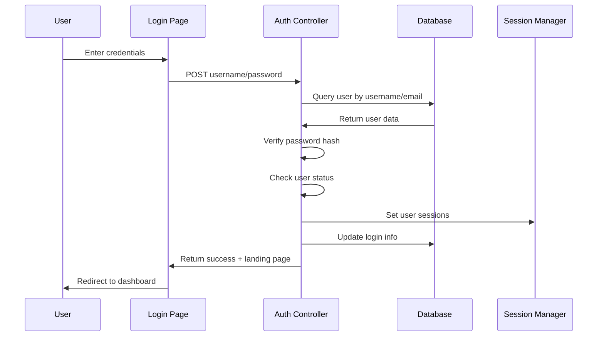

# Authentication System

## Overview

The HRM application implements a session-based authentication system that manages user login, session handling, and security validation. The system provides secure access control through password hashing, session management, and comprehensive user validation.

## User Story

**As a system user**, I want to securely log into the HRM system using my credentials, so that I can access authorized features and my session remains secure throughout my usage.

## Authentication Architecture

### Core Components

1. **Login Controller** (`app/auth.php`)
2. **User Management** (`app/UserClass.php`)
3. **Session Management** (PHP Sessions)
4. **Password Security** (PHP password functions)

### Authentication Flow



## Login Process

### User Authentication

The login process validates user credentials through multiple security checks:

```php
// Login action handler
if($_GET['action'] == 'login') {
    $username = $_POST['username'];
    $password = $_POST['password'];

    // Query user by username or email
    $getUser = "SELECT * FROM `users` WHERE (`username` = '$username' OR `email` LIKE '$username')";
    $userSet = $GLOBALS['conn']->query($getUser);
    
    // Validate user exists
    if($userSet->num_rows < 1) {
        $result['error'] = true;
        $result['errType'] = 'username';
        $result['msg'] = ' Username is not found.';
        echo json_encode($result); 
        exit();
    }

    while($row = $userSet->fetch_assoc()) {
        $user_id = $row['user_id'];
        $passDB = $row['password'];
        $status = $row['status'];
        $role = $row['role'];
        $full_name = $row['full_name'];

        // Verify password using secure hash comparison
        if (!password_verify($password, $passDB)) {
            $result['error'] = true;
            $result['errType'] = 'password';
            $result['msg'] = ' Incorrect password.';
            echo json_encode($result); 
            exit();
        }

        // Check user account status
        if(strtolower($status) != 'active') {
            $result['error'] = true;
            $result['errType'] = 'username';
            $result['msg'] = ' Inactive user. Please contact system administrator.';
            echo json_encode($result); 
            exit();
        }
    }

    // Get user's landing page based on permissions
    $land = get_landingMenu($user_id);

    // Set user sessions
    if(set_sessions($user_id)) {
        setLoginInfo($user_id);
    } else {
        $result['msg'] = ' Couldn\'t set sessions.';
        $result['error'] = true;
        $result['errType'] = 'sessions';
        echo json_encode($result); 
        exit();
    }

    $result['msg'] = "Successfully logged in.";
    $result['error'] = false;
    $result['land'] = $land;
    echo json_encode($result); 
    exit(); 
}
```

### Validation Steps

1. **User Existence Check**: Verifies username or email exists in database
2. **Password Verification**: Uses `password_verify()` for secure comparison
3. **Account Status Check**: Ensures user account is active
4. **Session Creation**: Establishes secure user session
5. **Login Tracking**: Records login timestamp and status

## Session Management

### Session Initialization

The `set_sessions()` function creates comprehensive user session data:

```php
function set_sessions($user_id) {
    $user = $GLOBALS['userClass']->get($user_id);
    
    // Basic user information
    $_SESSION['full_name'] = $user['full_name'];
    $_SESSION['emp_id'] = $user['emp_id'];
    $_SESSION['phone'] = $user['phone'];
    $_SESSION['email'] = $user['email'];
    $_SESSION['username'] = $user['username'];
    $_SESSION['myUser'] = $user['username'];
    $_SESSION['role'] = $user['role'];
    $_SESSION['branch_id'] = $user['branch_id'];
    $_SESSION['user_id'] = $user['user_id'];

    // Employee-specific data
    $emp_id = $user['emp_id'];
    $avatar = 'male_avatar.png';
    $employeeInfo = $GLOBALS['userClass']->get_emp($emp_id); 
    
    if(count($employeeInfo) > 0) {
        if(!$employeeInfo['avatar']) {
            if(strtolower($employeeInfo['gender']) == 'female') {
                $employeeInfo['avatar'] = 'female_avatar.png';
            } else {
                $employeeInfo['avatar'] = 'male_avatar.png';
            }
        }
        $avatar = $employeeInfo['avatar'];
    }
    $_SESSION['avatar'] = $avatar;

    // Permission management
    $all_sys_permissions = $GLOBALS['sys_permissions']->get_all();
    
    // Initialize all permissions as 'off'
    foreach ($all_sys_permissions as $sysPermission) {
        $_SESSION[$sysPermission] = 'off';
    }

    // Set role-based permissions to 'on'
    $role_permissions = $GLOBALS['sys_role_permissions']->get_permissions($user['role']);
    foreach ($role_permissions as $sysPermission) {
        $_SESSION[$sysPermission] = 'on';
    }
    
    return true;
}
```

### Session Data Structure

| Session Variable | Description | Example Value |
|------------------|-------------|---------------|
| `$_SESSION['user_id']` | Unique user identifier | 123 |
| `$_SESSION['username']` | Login username | john.doe |
| `$_SESSION['full_name']` | User's full name | John Doe |
| `$_SESSION['email']` | User's email address | john.doe@company.com |
| `$_SESSION['role']` | User's role ID | 2 |
| `$_SESSION['emp_id']` | Employee ID | 456 |
| `$_SESSION['branch_id']` | User's branch | 1 |
| `$_SESSION['avatar']` | Profile picture | male_avatar.png |
| `$_SESSION['manage_employees']` | Permission flag | 'on' or 'off' |

### Session Validation

The `authenticate()` function validates active sessions:

```php
function authenticate() {
    if(!isset($_SESSION['myUser']) || !$_SESSION['myUser']) {
        return false;
    }

    $username = $_SESSION['myUser'];

    $getUser = "SELECT * FROM `users` WHERE (`username` = '$username' OR `email` LIKE '$username') AND `status` NOT IN ('deleted')";
    $userSet = $GLOBALS['conn']->query($getUser);
    $status = '';
    
    while($row = $userSet->fetch_assoc()) {
        $user_id = $row['user_id'];
        $passDB = $row['password'];
        $status = $row['status'];
        $role = $row['role'];
        $full_name = $row['full_name'];
    }

    if(strtolower($status) != 'active') {
        $_SESSION['isLogged'] = false;
        return false;
    }

    set_sessions($user_id); 
    return true;
}
```

## Password Security

### Password Hashing

The system uses PHP's built-in password hashing functions for security:

```php
// Password hashing during user creation/update
$password = password_hash($post['phone_number'], PASSWORD_DEFAULT);

// Store in user data
$userData = array(
    'full_name' => $post['full_name'],
    'phone' => $post['phone_number'],
    'email' => $post['email'],
    'username' => usernameFromEmail($post['email']),
    'password' => $password,  // Hashed password
    'role' => 'employee'
);
```

### Password Verification

Login verification uses secure password comparison:

```php
// During login process
if (!password_verify($password, $passDB)) {
    $result['error'] = true;
    $result['errType'] = 'password';
    $result['msg'] = ' Incorrect password.';
    echo json_encode($result); 
    exit();
}
```

### Password Security Features

1. **Secure Hashing**: Uses `PASSWORD_DEFAULT` algorithm (currently bcrypt)
2. **Salt Generation**: Automatic salt generation for each password
3. **Timing Attack Protection**: `password_verify()` prevents timing attacks
4. **No Plain Text**: Passwords never stored or transmitted in plain text

## Login Tracking

### Login Information Recording

The system tracks user login activity:

```php
function setLoginInfo($userID, $logout = false) {
    $this_time = date('Y-m-d h:i:s');
    $is_logged = 'yes';
    $column = 'this_time';
    
    if($logout) { 
        $is_logged = 'no'; 
        $column = 'last_logged';
    }
    
    $stmt = $GLOBALS['conn']->prepare("UPDATE `users` SET `is_logged` = ?, `$column` = ? WHERE `user_id` = ?");
    $stmt->bind_param("sss", $is_logged, $this_time, $userID);
    
    if(!$stmt->execute()) {
        echo $stmt->error;
    }
}
```

### Tracked Information

- **Login Status**: Whether user is currently logged in
- **Login Time**: Timestamp of current session start
- **Last Login**: Timestamp of previous session
- **Session Duration**: Implicit through login/logout tracking

## Landing Page Routing

### Permission-Based Routing

Users are redirected to appropriate pages based on their permissions:

```php
function get_landingMenu($user_id) {
    $permissions = $GLOBALS['userClass']->getPermissions($user_id);

    // Centralized route configuration (ordered by priority)
    $menuConfig = [
        ['permission' => 'manage_dashboard', 'route' => './dashboard'],
        ['permission' => 'manage_employees', 'route' => './employees'],
        ['permission' => 'manage_documents', 'route' => './documents'],
        ['permission' => 'manage_attendance', 'route' => './attendance'],
        ['permission' => 'manage_leave', 'route' => './leave'],
        ['permission' => 'manage_payroll', 'route' => './payroll'],
        ['permission' => 'manage_users', 'route' => './users'],
        ['permission' => 'manage_reports', 'route' => './reports'],
        ['permission' => 'manage_settings', 'route' => './settings'],
    ];

    // Convert to faster lookup
    $userPermissions = array_flip($permissions);

    foreach ($menuConfig as $item) {
        if (isset($userPermissions[$item['permission']])) {
            return $item['route'];
        }
    }

    // Default landing page
    return './dashboard';
}
```

### Route Priority

The system uses a priority-based routing system:

1. **Dashboard**: Default for users with dashboard access
2. **Employees**: For HR managers and administrators
3. **Documents**: For document management roles
4. **Attendance**: For attendance managers
5. **Payroll**: For payroll administrators
6. **Settings**: For system administrators

## Page Protection

### Authentication Enforcement

Protected pages use authentication checks:

```php
// In files/app_header.php
require('./app/init.php');
if (!authenticate()) {
    header("Location: ".baseUri()."/login ");
    exit; // Important to exit to prevent further execution
}
```

### Login Page Redirection

Login pages redirect authenticated users:

```php
// In files/login_header.php
require('./app/auth.php');
require('./app/utilities.php');
if (authenticate()) {
    header("Location: ".baseUri()."/".get_landingMenu($_SESSION['user_id'])." ");
}
```

## Security Features

### Input Sanitization

The system sanitizes user input before processing:

```php
// Example from controllers
$post = escapePostData($_POST);
$username = escapeStr($_POST['username']);
$password = escapeStr($_POST['password']);
```

### Session Security

1. **Session Start**: Proper session initialization
2. **Session Validation**: Regular authentication checks
3. **Session Data**: Comprehensive user information storage
4. **Session Cleanup**: Proper logout handling

### Error Handling

The system provides structured error responses:

```php
$result = [];
$result['error'] = true;
$result['errType'] = 'username'; // or 'password', 'sessions'
$result['msg'] = 'Specific error message';
echo json_encode($result);
```

## Integration Points

### Database Integration

- **User Table**: Stores user credentials and status
- **Employee Table**: Links users to employee records
- **Role Tables**: Manages user roles and permissions

### Application Integration

- **Controllers**: All controllers check authentication
- **Views**: Pages include authentication headers
- **API Endpoints**: All API calls validate sessions

## Configuration

### Authentication Settings

The system uses configuration from:

- **Database Connection**: `app/db.php`
- **System Settings**: `sys_settings` table
- **Role Configuration**: `sys_roles` and `sys_role_permissions` tables

### Session Configuration

PHP session settings are managed through:

- **Session Start**: Called in `auth.php`
- **Session Data**: Stored in `$_SESSION` superglobal
- **Session Timeout**: Handled by PHP configuration

## Best Practices

### Implemented Security Measures

1. **Password Hashing**: Secure password storage
2. **Session Management**: Proper session handling
3. **Input Validation**: Basic input sanitization
4. **Status Checking**: User account status validation
5. **Permission Checking**: Role-based access control

### Recommended Improvements

1. **CSRF Protection**: Add CSRF tokens to forms
2. **Session Regeneration**: Regenerate session ID after login
3. **Rate Limiting**: Implement login attempt limiting
4. **Secure Headers**: Add security headers
5. **Input Validation**: Enhanced input validation
6. **Prepared Statements**: Use prepared statements consistently