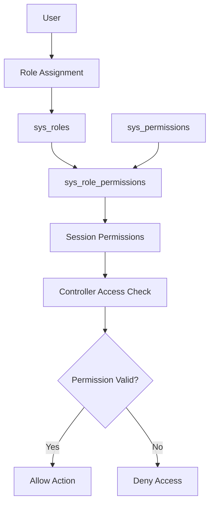
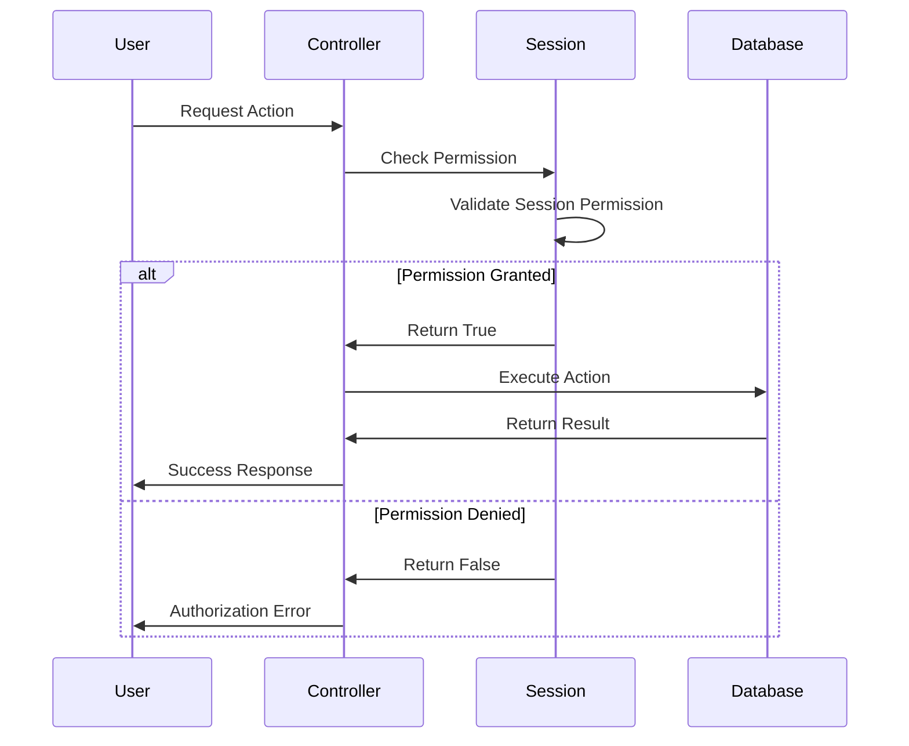

# Authorization and Permissions System

## Overview

The HRM application implements a comprehensive Role-Based Access Control (RBAC) system that manages user permissions through roles, system permissions, and granular access controls. This system ensures that users can only access features and data appropriate to their organizational role and responsibilities.

## User Story

**As a system administrator**, I want to control user access to different system features based on their roles and responsibilities, so that sensitive data and critical functions are protected while ensuring users can perform their required tasks efficiently.

## RBAC Architecture

### Core Components

1. **System Roles** (`sys_roles` table)
2. **System Permissions** (`sys_permissions` table)
3. **Role-Permission Mapping** (`sys_role_permissions` table)
4. **User-Role Assignment** (`users.role` field)
5. **Permission Checking Functions**

### Permission Model Diagram



## Database Schema

### System Roles Table

```sql
CREATE TABLE sys_roles (
    id INT AUTO_INCREMENT PRIMARY KEY,
    name VARCHAR(255) NOT NULL,
    description TEXT,
    status ENUM('active', 'inactive') DEFAULT 'active',
    created_at TIMESTAMP DEFAULT CURRENT_TIMESTAMP,
    updated_at TIMESTAMP DEFAULT CURRENT_TIMESTAMP ON UPDATE CURRENT_TIMESTAMP
);
```

**Common Roles:**
- `admin` - System Administrator
- `manager` - Department Manager
- `hr_manager` - HR Manager
- `payroll_admin` - Payroll Administrator
- `employee` - Regular Employee

### System Permissions Table

```sql
CREATE TABLE sys_permissions (
    id INT AUTO_INCREMENT PRIMARY KEY,
    name VARCHAR(255) NOT NULL,
    actions JSON,
    description TEXT,
    status ENUM('active', 'inactive') DEFAULT 'active',
    created_at TIMESTAMP DEFAULT CURRENT_TIMESTAMP
);
```

**Permission Actions Structure:**
```json
{
    "create": {"code": "create_employees", "name": "Create Employees"},
    "read": {"code": "view_employees", "name": "View Employees"},
    "update": {"code": "edit_employees", "name": "Edit Employees"},
    "delete": {"code": "delete_employees", "name": "Delete Employees"}
}
```

### Role-Permission Mapping Table

```sql
CREATE TABLE sys_role_permissions (
    id INT AUTO_INCREMENT PRIMARY KEY,
    role_id INT NOT NULL,
    permission VARCHAR(255) NOT NULL,
    granted BOOLEAN DEFAULT TRUE,
    created_at TIMESTAMP DEFAULT CURRENT_TIMESTAMP,
    FOREIGN KEY (role_id) REFERENCES sys_roles(id)
);
```

## Permission Management Classes

### Sys_Permissions Class

```php
class Sys_Permissions extends Model {
    public function __construct() {
        parent::__construct('sys_permissions');
    }

    public function get($id) {
        return $this->read($id);
    }

    public function get_all() {
        $all_sys_permissions = [];
        $sysPermissions = $GLOBALS['sys_permissions']->read_all();
        
        foreach($sysPermissions as $permission) {
            $actions = json_decode($permission['actions']);
            foreach ($actions as $action_name => $action_code) {
                $all_sys_permissions[] = $action_code->code;
            }
        }

        return $all_sys_permissions;
    }
}
```

### Sys_roles Class

```php
class Sys_roles extends Model {
    public function __construct() {
        parent::__construct('sys_roles');
    }

    public function get($id) {
        return $this->read($id);
    }
}
```

### Sys_role_permissions Class

```php
class Sys_role_permissions extends Model {
    public function __construct() {
        parent::__construct('sys_role_permissions');
    }

    public function get($id) {
        return $this->read($id);
    }

    public function get_permissions($role_id) {
        $allPermissions = [];
        $permissions = get_data2('sys_role_permissions', ['role_id' => $role_id]);
        
        foreach ($permissions as $permission) {
            $allPermissions[] = $permission['permission'];
        }
        
        return $allPermissions;
    }
}
```

## Permission System Implementation

### User Permission Retrieval

The `UserClass` retrieves permissions through role-based mapping:

```php
public function getPermissions($userId) {
    $userPermissions = [];
    $role_id = $this->read($userId)['role'];
    return $role_permissions = $GLOBALS['sys_role_permissions']->get_permissions($role_id);
}
```

### Session Permission Setting

During login, permissions are loaded into the user session:

```php
// Initialize all system permissions as 'off'
$all_sys_permissions = $GLOBALS['sys_permissions']->get_all();
foreach ($all_sys_permissions as $sysPermission) {
    $_SESSION[$sysPermission] = 'off';
}

// Set role-based permissions to 'on'
$role_permissions = $GLOBALS['sys_role_permissions']->get_permissions($user['role']);
foreach ($role_permissions as $sysPermission) {
    $_SESSION[$sysPermission] = 'on';
}
```

## Permission Checking Functions

### check_session() Function

Verifies if a user has specific permissions:

```php
function check_session($authKey) {
    if (is_array($authKey)) {
        // Check if user has ANY of the provided permissions
        foreach ($authKey as $key) {
            if (isset($_SESSION[$key]) && $_SESSION[$key] === 'on') {
                return true;
            }
        }
        return false;
    }

    // Check single permission
    return isset($_SESSION[$authKey]) && $_SESSION[$authKey] === 'on';
}
```

### check_auth() Function

Enforces permission requirements with error handling:

```php
function check_auth($authKey, $msg = "You are not authorized to perform this action.") {
    if(!check_session($authKey)) {
        $result = [];
        $result['error'] = true;
        $result['msg'] = $msg;
        echo json_encode($result);
        exit();
    }
    return true;
}
```

## Permission Categories

### Employee Management Permissions

| Permission Code | Description | Typical Roles |
|----------------|-------------|---------------|
| `create_employees` | Create new employee records | HR Manager, Admin |
| `edit_employees` | Modify employee information | HR Manager, Admin |
| `view_employees` | View employee data | HR Manager, Manager, Admin |
| `delete_employees` | Remove employee records | Admin |
| `manage_employee_docs` | Manage employee documents | HR Manager, Admin |

### Payroll Permissions

| Permission Code | Description | Typical Roles |
|----------------|-------------|---------------|
| `manage_payroll` | Access payroll system | Payroll Admin, Admin |
| `create_payroll` | Generate payroll | Payroll Admin, Admin |
| `approve_payroll` | Approve payroll for payment | Manager, Admin |
| `view_payroll` | View payroll data | Payroll Admin, Manager, Admin |
| `manage_payroll_transactions` | Handle payroll transactions | Payroll Admin, Admin |

### Attendance Permissions

| Permission Code | Description | Typical Roles |
|----------------|-------------|---------------|
| `manage_attendance` | Manage attendance records | HR Manager, Manager, Admin |
| `view_attendance` | View attendance data | HR Manager, Manager, Admin |
| `manage_timesheet` | Manage timesheets | HR Manager, Manager, Admin |
| `manage_leave` | Manage leave requests | HR Manager, Manager, Admin |

### Administrative Permissions

| Permission Code | Description | Typical Roles |
|----------------|-------------|---------------|
| `manage_users` | Manage user accounts | Admin |
| `manage_roles` | Manage system roles | Admin |
| `manage_permissions` | Manage permissions | Admin |
| `manage_settings` | System configuration | Admin |
| `manage_reports` | Generate and view reports | Manager, Admin |

### Organizational Permissions

| Permission Code | Description | Typical Roles |
|----------------|-------------|---------------|
| `manage_organization` | Manage company structure | Admin |
| `manage_branches` | Manage branches | Admin |
| `manage_locations` | Manage locations | Admin |
| `manage_departments` | Manage departments | Manager, Admin |

## Controller Permission Implementation

### Employee Controller Example

```php
// Employee creation
if($_GET['endpoint'] == 'employee') {
    check_auth('create_employees');
    // Process employee creation
}

// Employee bulk upload
if($_GET['endpoint'] == 'upload_employees') {
    check_auth('create_employees');
    // Process bulk employee upload
}

// Employee document management
if($_GET['endpoint'] == 'emp_docs') {
    check_auth('create_employee_docs');
    // Process document upload
}

// Employee update
if($_GET['action'] == 'update' && $_GET['endpoint'] == 'employee') {
    check_auth('edit_employees');
    // Process employee update
}
```

### Payroll Controller Example

```php
// Payroll generation
if($_GET['endpoint'] == 'payroll') {
    check_auth('create_payroll');
    // Process payroll generation
}

// Payroll approval
if($_GET['endpoint'] == 'approve_payroll') {
    check_auth('approve_payroll');
    // Process payroll approval
}
```

## Multi-Permission Checking

### Array-Based Permission Checking

The system supports checking multiple permissions:

```php
// Check if user has ANY of these permissions
$permissions = ['manage_employees', 'view_employees', 'edit_employees'];
if(check_session($permissions)) {
    // User has at least one of the required permissions
}

// Usage in controllers
check_auth(['create_employees', 'edit_employees'], "You need employee management permissions.");
```

### Hierarchical Permissions

Some operations require multiple permission levels:

```php
// Example: Payroll approval might require both payroll and approval permissions
check_auth('manage_payroll');
check_auth('approve_payroll');
```

## Role-Based Landing Pages

### Permission-Based Routing

Users are directed to appropriate pages based on their highest-priority permission:

```php
function get_landingMenu($user_id) {
    $permissions = $GLOBALS['userClass']->getPermissions($user_id);

    $menuConfig = [
        ['permission' => 'manage_dashboard', 'route' => './dashboard'],
        ['permission' => 'manage_employees', 'route' => './employees'],
        ['permission' => 'manage_documents', 'route' => './documents'],
        ['permission' => 'manage_attendance', 'route' => './attendance'],
        ['permission' => 'manage_leave', 'route' => './leave'],
        ['permission' => 'manage_payroll', 'route' => './payroll'],
        ['permission' => 'manage_users', 'route' => './users'],
        ['permission' => 'manage_reports', 'route' => './reports'],
        ['permission' => 'manage_settings', 'route' => './settings'],
    ];

    $userPermissions = array_flip($permissions);

    foreach ($menuConfig as $item) {
        if (isset($userPermissions[$item['permission']])) {
            return $item['route'];
        }
    }

    return './dashboard'; // Default fallback
}
```

## Permission Inheritance

### Role Hierarchy

The system supports role-based permission inheritance:

1. **Admin**: Full system access
2. **Manager**: Department-level access
3. **HR Manager**: HR-specific functions
4. **Employee**: Limited self-service access

### Permission Cascading

Higher-level roles typically inherit lower-level permissions:

```php
// Example role permission assignments
$admin_permissions = [
    'manage_dashboard', 'manage_employees', 'manage_payroll',
    'manage_attendance', 'manage_users', 'manage_settings',
    'manage_reports', 'manage_organization'
];

$manager_permissions = [
    'manage_dashboard', 'view_employees', 'manage_attendance',
    'view_payroll', 'manage_reports'
];

$employee_permissions = [
    'manage_dashboard', 'view_own_data', 'manage_own_attendance'
];
```

## Security Features

### Permission Validation

1. **Session-Based**: Permissions stored in user sessions
2. **Real-Time Checking**: Permissions validated on each request
3. **Granular Control**: Fine-grained permission assignments
4. **Role-Based**: Permissions assigned through roles

### Access Control Flow



## Error Handling

### Authorization Errors

The system provides structured error responses for authorization failures:

```php
function check_auth($authKey, $msg = "You are not authorized to perform this action.") {
    if(!check_session($authKey)) {
        $result = [];
        $result['error'] = true;
        $result['msg'] = $msg;
        echo json_encode($result);
        exit();
    }
    return true;
}
```

### Custom Error Messages

Controllers can provide specific error messages:

```php
check_auth('manage_payroll', "You need payroll management permissions to access this feature.");
check_auth('create_employees', "Only HR managers can create employee records.");
```

## Best Practices

### Implemented Security Measures

1. **Principle of Least Privilege**: Users get minimum required permissions
2. **Role-Based Assignment**: Permissions assigned through roles
3. **Session Validation**: Permissions checked on each request
4. **Granular Control**: Specific permissions for different actions

### Recommended Improvements

1. **Permission Auditing**: Log permission usage and changes
2. **Time-Based Permissions**: Temporary permission assignments
3. **Resource-Level Permissions**: Object-specific access control
4. **Permission Delegation**: Temporary permission sharing
5. **Multi-Factor Authorization**: Additional security for sensitive operations

## Integration Points

### Database Integration

- **User Roles**: Stored in `users.role` field
- **Role Definitions**: Managed in `sys_roles` table
- **Permission Mapping**: Defined in `sys_role_permissions` table

### Application Integration

- **Controllers**: All controllers implement permission checking
- **Views**: UI elements hidden/shown based on permissions
- **API Endpoints**: All API calls validate permissions
- **Navigation**: Menu items filtered by user permissions