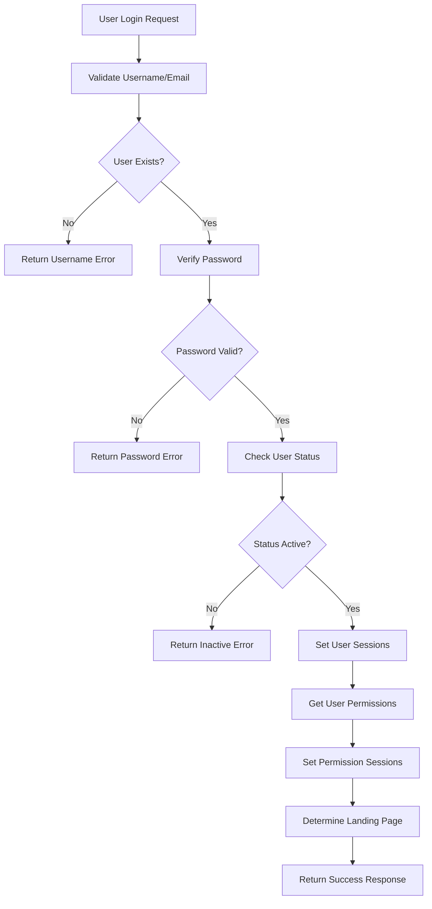
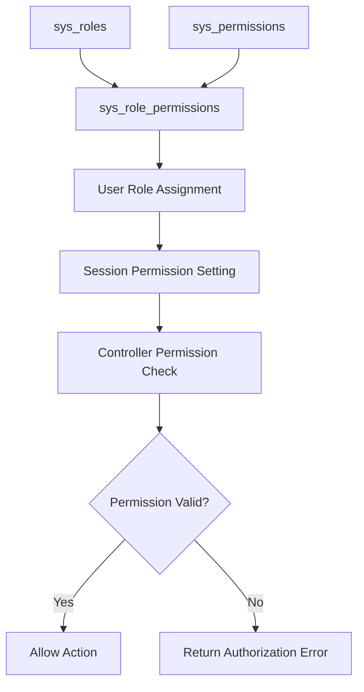

# Security and Authentication Code Analysis

## Overview

This document provides a comprehensive analysis of the security and authentication mechanisms implemented in the HRM application. The system uses a role-based access control (RBAC) model with session-based authentication and permission checking.

## Authentication System Architecture

### Core Authentication Files

#### 1. app/auth.php
The main authentication controller that handles:
- User login processing
- Session management
- Permission checking
- Landing page routing based on user permissions

#### 2. app/UserClass.php
User management class extending the base Model class:
- User data retrieval
- Permission management
- Employee-user relationship handling

#### 3. app/sys_permissions.php
System permissions management with three main classes:
- `Sys_Permissions`: Manages system permissions
- `Sys_roles`: Manages user roles
- `Sys_role_permissions`: Manages role-permission relationships

## Authentication Flow Analysis

### Login Process

```php
// Login action in auth.php
if($_GET['action'] == 'login') {
    $username = $_POST['username'];
    $password = $_POST['password'];
    
    // Query user by username or email
    $getUser = "SELECT * FROM `users` WHERE (`username` = '$username' OR `email` LIKE '$username')";
    $userSet = $GLOBALS['conn']->query($getUser);
    
    // Validate user exists
    if($userSet->num_rows < 1) {
        // Return username not found error
    }
    
    // Verify password and status
    while($row = $userSet->fetch_assoc()) {
        if (!password_verify($password, $passDB)) {
            // Return incorrect password error
        }
        
        if(strtolower($status) != 'active') {
            // Return inactive user error
        }
    }
    
    // Set sessions and login info
    if(set_sessions($user_id)) {
        setLoginInfo($user_id);
    }
}
```

### Session Management

The `set_sessions()` function establishes user session data:

```php
function set_sessions($user_id) {
    $user = $GLOBALS['userClass']->get($user_id);
    
    // Set basic user session data
    $_SESSION['full_name'] = $user['full_name'];
    $_SESSION['emp_id'] = $user['emp_id'];
    $_SESSION['phone'] = $user['phone'];
    $_SESSION['email'] = $user['email'];
    $_SESSION['username'] = $user['username'];
    $_SESSION['myUser'] = $user['username'];
    $_SESSION['role'] = $user['role'];
    $_SESSION['branch_id'] = $user['branch_id'];
    $_SESSION['user_id'] = $user['user_id'];
    
    // Set avatar based on employee gender
    $emp_id = $user['emp_id'];
    $employeeInfo = $GLOBALS['userClass']->get_emp($emp_id);
    if(count($employeeInfo) > 0) {
        if(!$employeeInfo['avatar']) {
            if(strtolower($employeeInfo['gender']) == 'female') {
                $employeeInfo['avatar'] = 'female_avatar.png';
            } else {
                $employeeInfo['avatar'] = 'male_avatar.png';
            }
        }
        $avatar = $employeeInfo['avatar'];
    }
    $_SESSION['avatar'] = $avatar;
    
    // Initialize all system permissions as 'off'
    $all_sys_permissions = $GLOBALS['sys_permissions']->get_all();
    foreach ($all_sys_permissions as $sysPermission) {
        $_SESSION[$sysPermission] = 'off';
    }
    
    // Set role-based permissions to 'on'
    $role_permissions = $GLOBALS['sys_role_permissions']->get_permissions($user['role']);
    foreach ($role_permissions as $sysPermission) {
        $_SESSION[$sysPermission] = 'on';
    }
    
    return true;
}
```

### Authentication Verification

The `authenticate()` function verifies active sessions:

```php
function authenticate() {
    if(!isset($_SESSION['myUser']) || !$_SESSION['myUser']) {
        return false;
    }
    
    $username = $_SESSION['myUser'];
    $getUser = "SELECT * FROM `users` WHERE (`username` = '$username' OR `email` LIKE '$username') AND `status` NOT IN ('deleted')";
    $userSet = $GLOBALS['conn']->query($getUser);
    
    while($row = $userSet->fetch_assoc()) {
        $status = $row['status'];
    }
    
    if(strtolower($status) != 'active') {
        $_SESSION['isLogged'] = false;
        return false;
    }
    
    set_sessions($user_id);
    return true;
}
```

## Role-Based Access Control (RBAC)

### Permission System Architecture

The system implements a three-tier permission model:

1. **System Permissions** (`sys_permissions` table)
   - Defines available permissions with JSON actions
   - Each permission has multiple actions (create, read, update, delete)

2. **System Roles** (`sys_roles` table)
   - Defines user roles (admin, manager, employee, etc.)
   - Each role has a description and status

3. **Role-Permission Mapping** (`sys_role_permissions` table)
   - Maps specific permissions to roles
   - Stores permission codes as strings

### Permission Checking Functions

#### check_session()
Verifies if a user has specific permissions:

```php
function check_session($authKey) {
    if (is_array($authKey)) {
        foreach ($authKey as $key) {
            if (isset($_SESSION[$key]) && $_SESSION[$key] === 'on') {
                return true;
            }
        }
        return false;
    }
    
    return isset($_SESSION[$authKey]) && $_SESSION[$authKey] === 'on';
}
```

#### check_auth()
Enforces permission requirements with error handling:

```php
function check_auth($authKey, $msg = "You are not authorized to perform this action.") {
    if(!check_session($authKey)) {
        $result = [];
        $result['error'] = true;
        $result['msg'] = $msg;
        echo json_encode($result);
        exit();
    }
    return true;
}
```

### Permission Usage in Controllers

Controllers use `check_auth()` to enforce permissions:

```php
// Example from hrm_controller.php
if($_GET['endpoint'] == 'employee') {
    check_auth('create_employees');
    // Process employee creation
}

if($_GET['endpoint'] == 'upload_employees') {
    check_auth('create_employees');
    // Process bulk employee upload
}

if($_GET['endpoint'] == 'folder') {
    check_auth('manage_employee_docs');
    // Process folder creation
}
```

## Security Features Analysis

### Password Security

1. **Password Hashing**: Uses PHP's `password_hash()` with `PASSWORD_DEFAULT`
2. **Password Verification**: Uses `password_verify()` for secure comparison
3. **No Plain Text Storage**: Passwords are never stored in plain text

```php
// Password hashing during user creation
$password = password_hash($post['phone_number'], PASSWORD_DEFAULT);

// Password verification during login
if (!password_verify($password, $passDB)) {
    // Handle incorrect password
}
```

### Session Security

1. **Session Initialization**: `session_start()` called in auth.php
2. **Session Validation**: Regular checks for active sessions
3. **Session Data**: Comprehensive user data stored in sessions
4. **Session Cleanup**: Proper session management on logout

### Input Sanitization

The system uses `escapePostData()` and `escapeStr()` functions for input sanitization:

```php
// Example from controllers
$post = escapePostData($_POST);
$data = array();
foreach ($employeeData as $index => $value) {
    $data[$index] = isset($employeeData[$index]) ? $employeeData[$index]: "";
}
```

### SQL Injection Prevention

1. **Prepared Statements**: Used in some areas for database queries
2. **Input Escaping**: Data sanitization before database operations
3. **Parameterized Queries**: Some queries use parameter binding

```php
// Example of prepared statement usage
$stmt = $GLOBALS['conn']->prepare("UPDATE `users` SET `is_logged` = ?, `$column` = ? WHERE `user_id` = ?");
$stmt->bind_param("sss", $is_logged, $this_time, $userID);
```

## Landing Page Routing

The system determines user landing pages based on permissions:

```php
function get_landingMenu($user_id) {
    $permissions = $GLOBALS['userClass']->getPermissions($user_id);
    
    $menuConfig = [
        ['permission' => 'manage_dashboard', 'route' => './dashboard'],
        ['permission' => 'manage_employees', 'route' => './employees'],
        ['permission' => 'manage_documents', 'route' => './documents'],
        ['permission' => 'manage_attendance', 'route' => './attendance'],
        // ... more menu items
    ];
    
    $userPermissions = array_flip($permissions);
    
    foreach ($menuConfig as $item) {
        if (isset($userPermissions[$item['permission']])) {
            return $item['route'];
        }
    }
    
    return './dashboard'; // Default fallback
}
```

## User Management Integration

### User-Employee Relationship

Users are linked to employees through the `emp_id` field:

```php
public function get_emp($emp_id) {
    $conn = $GLOBALS['conn'];
    $return = [];
    if($emp_id) {
        $query = $conn->query("SELECT * FROM `employees` WHERE `employee_id` = $emp_id");
        if($query->num_rows > 0) {
            $return = $query->fetch_assoc();
        }
    }
    return $return;
}
```

### Permission Retrieval

User permissions are retrieved through role-based mapping:

```php
public function getPermissions($userId) {
    $userPermissions = [];
    $role_id = $this->read($userId)['role'];
    return $role_permissions = $GLOBALS['sys_role_permissions']->get_permissions($role_id);
}
```

## Security Vulnerabilities and Concerns

### Identified Issues

1. **SQL Injection Risk**: Some queries use direct string concatenation
   ```php
   $getUser = "SELECT * FROM `users` WHERE (`username` = '$username' OR `email` LIKE '$username')";
   ```

2. **Session Fixation**: No session regeneration after login

3. **Error Information Disclosure**: Detailed error messages may reveal system information

4. **Input Validation**: Limited input validation beyond basic sanitization

### Recommendations

1. **Use Prepared Statements**: Replace all direct SQL queries with prepared statements
2. **Implement CSRF Protection**: Add CSRF tokens to forms
3. **Session Security**: Implement session regeneration and timeout
4. **Input Validation**: Add comprehensive input validation
5. **Error Handling**: Implement secure error handling without information disclosure

## Authentication Flow Diagram



## Permission System Diagram

