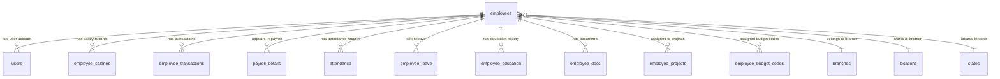
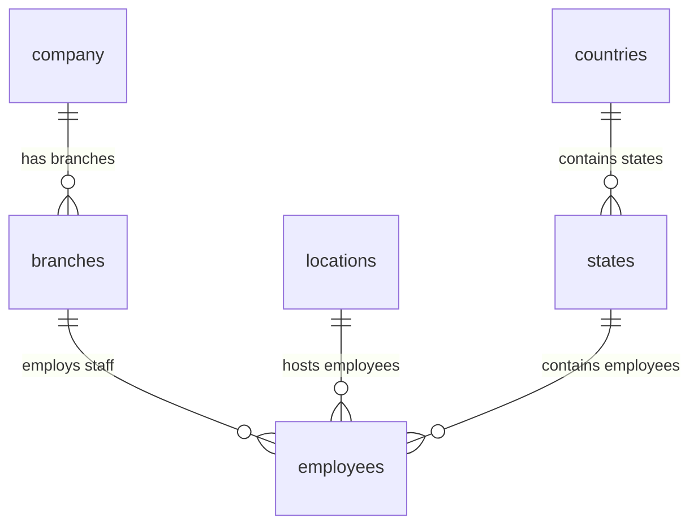

# Database Table Relationships

## Overview

This document describes the relationships between tables in the HRM application database. The system follows a relational database design with proper foreign key constraints and normalized data structure.

## Primary Entity Relationships

### Employee-Centric Relationships

The `employees` table serves as the central hub for most relationships in the system:

### Organizational Hierarchy

## Detailed Relationship Mappings

### 1. Employee Relationships

#### employees → users (One-to-One)
- **Foreign Key**: users.emp_id → employees.employee_id
- **Relationship**: Each employee can have one user account
- **Constraint**: Optional (employees may not have system access)

#### employees → branches (Many-to-One)
- **Foreign Key**: employees.branch_id → branches.id
- **Relationship**: Multiple employees belong to one branch
- **Constraint**: Required (every employee must be assigned to a branch)

#### employees → locations (Many-to-One)
- **Foreign Key**: employees.location_id → locations.id
- **Relationship**: Multiple employees work at one location
- **Constraint**: Required (every employee must have a work location)

#### employees → states (Many-to-One)
- **Foreign Key**: employees.state_id → states.id
- **Relationship**: Multiple employees are located in one state
- **Constraint**: Required (every employee must be in a state)

### 2. Payroll Relationships

#### payroll → payroll_details (One-to-Many)
- **Foreign Key**: payroll_details.payroll_id → payroll.id
- **Relationship**: One payroll contains multiple employee details
- **Constraint**: Required (payroll details must belong to a payroll)

#### employees → payroll_details (One-to-Many)
- **Foreign Key**: payroll_details.emp_id → employees.employee_id
- **Relationship**: One employee has multiple payroll records
- **Constraint**: Required (payroll details must reference an employee)

#### employees → employee_salaries (One-to-Many)
- **Foreign Key**: employee_salaries.emp_id → employees.employee_id
- **Relationship**: One employee can have multiple salary records (history)
- **Constraint**: Required (salary must belong to an employee)

#### employees → employee_transactions (One-to-Many)
- **Foreign Key**: employee_transactions.emp_id → employees.employee_id
- **Relationship**: One employee can have multiple transactions
- **Constraint**: Required (transaction must belong to an employee)

#### payroll → employee_transactions (One-to-Many)
- **Foreign Key**: employee_transactions.payroll_id → payroll.id
- **Relationship**: Transactions can be associated with payroll periods
- **Constraint**: Optional (transactions may exist outside payroll)### 3. Att
endance and Time Tracking Relationships

#### employees → attendance (One-to-Many)
- **Foreign Key**: attendance.emp_id → employees.employee_id
- **Relationship**: One employee has multiple attendance records
- **Constraint**: Required (attendance must belong to an employee)

#### employees → atten_details (One-to-Many)
- **Foreign Key**: atten_details.emp_id → employees.employee_id
- **Relationship**: One employee has multiple attendance detail records
- **Constraint**: Required (attendance details must belong to an employee)

#### employees → timesheet (One-to-Many)
- **Foreign Key**: timesheet.emp_id → employees.employee_id
- **Relationship**: One employee has multiple timesheet records
- **Constraint**: Required (timesheet must belong to an employee)

#### timesheet → timesheet_details (One-to-Many)
- **Foreign Key**: timesheet_details.timesheet_id → timesheet.id
- **Relationship**: One timesheet contains multiple detail entries
- **Constraint**: Required (timesheet details must belong to a timesheet)

#### employees → employee_leave (One-to-Many)
- **Foreign Key**: employee_leave.emp_id → employees.employee_id
- **Relationship**: One employee can have multiple leave records
- **Constraint**: Required (leave must belong to an employee)

#### leave_types → employee_leave (One-to-Many)
- **Foreign Key**: employee_leave.leave_id → leave_types.id
- **Relationship**: One leave type can be used by multiple leave requests
- **Constraint**: Required (leave must have a type)

#### payroll → attendance (One-to-Many)
- **Foreign Key**: attendance.payroll_id → payroll.id
- **Relationship**: Attendance records can be linked to payroll periods
- **Constraint**: Optional (attendance may exist without payroll association)

#### payroll → timesheet (One-to-Many)
- **Foreign Key**: timesheet.payroll_id → payroll.id
- **Relationship**: Timesheets can be linked to payroll periods
- **Constraint**: Optional (timesheets may exist without payroll association)

### 4. Project and Budget Relationships

#### employees → employee_projects (One-to-Many)
- **Foreign Key**: employee_projects.emp_id → employees.employee_id
- **Relationship**: One employee can be assigned to multiple projects
- **Constraint**: Required (assignment must reference an employee)

#### projects → employee_projects (One-to-Many)
- **Foreign Key**: employee_projects.project_id → projects.id
- **Relationship**: One project can have multiple employees assigned
- **Constraint**: Required (assignment must reference a project)

#### employees → employee_budget_codes (One-to-Many)
- **Foreign Key**: employee_budget_codes.emp_id → employees.employee_id
- **Relationship**: One employee can be assigned to multiple budget codes
- **Constraint**: Required (assignment must reference an employee)

#### budget_codes → employee_budget_codes (One-to-Many)
- **Foreign Key**: employee_budget_codes.code_id → budget_codes.id
- **Relationship**: One budget code can have multiple employees assigned
- **Constraint**: Required (assignment must reference a budget code)

#### employees → res_allocation (One-to-Many)
- **Foreign Key**: res_allocation.emp_id → employees.employee_id
- **Relationship**: One employee can have multiple resource allocations
- **Constraint**: Required (allocation must belong to an employee)

#### timesheet_details → projects (Many-to-One)
- **Foreign Key**: timesheet_details.project_id → projects.id
- **Relationship**: Timesheet entries can be associated with projects
- **Constraint**: Optional (timesheet entries may not be project-specific)###
 5. Financial System Relationships

#### bank_accounts → payroll_details (One-to-Many)
- **Foreign Key**: payroll_details.bank_id → bank_accounts.id
- **Relationship**: Payroll payments are made to specific bank accounts
- **Constraint**: Required (payroll must specify a bank account)

#### banks → bank_accounts (One-to-Many)
- **Foreign Key**: bank_accounts.bank_id → banks.id (implied)
- **Relationship**: One bank can have multiple accounts
- **Constraint**: Optional (bank accounts may reference bank information)

#### financial_accounts → fn_transactions (One-to-Many)
- **Foreign Key**: fn_transactions.account_id → financial_accounts.id
- **Relationship**: Financial transactions are categorized by account
- **Constraint**: Required (transaction must have an account category)

#### trans_subtypes → employee_transactions (One-to-Many)
- **Foreign Key**: employee_transactions.transaction_subtype → trans_subtypes.name
- **Relationship**: Employee transactions are categorized by subtype
- **Constraint**: Optional (transactions may not have subtypes)

### 6. Performance and Training Relationships

#### employees → performance (One-to-Many)
- **Foreign Key**: performance.emp_id → employees.employee_id
- **Relationship**: One employee can have multiple performance reviews
- **Constraint**: Required (performance review must belong to an employee)

#### users → performance (One-to-Many)
- **Foreign Key**: performance.reviewer_id → users.user_id
- **Relationship**: One user can review multiple employees
- **Constraint**: Required (performance review must have a reviewer)

#### employees → employee_performance (One-to-Many)
- **Foreign Key**: employee_performance.emp_id → employees.employee_id
- **Relationship**: One employee can have multiple performance metrics
- **Constraint**: Required (performance metric must belong to an employee)

#### employees → training_list (One-to-Many)
- **Foreign Key**: training_list.emp_id → employees.employee_id
- **Relationship**: One employee can attend multiple training sessions
- **Constraint**: Required (training must be assigned to an employee)

#### trainers → training_list (One-to-Many)
- **Foreign Key**: training_list.trainer_id → trainers.id
- **Relationship**: One trainer can conduct multiple training sessions
- **Constraint**: Required (training must have a trainer)

### 7. HR Management Relationships

#### employees → promotions (One-to-Many)
- **Foreign Key**: promotions.emp_id → employees.employee_id
- **Relationship**: One employee can have multiple promotions
- **Constraint**: Required (promotion must belong to an employee)

#### employees → transfers (One-to-Many)
- **Foreign Key**: transfers.emp_id → employees.employee_id
- **Relationship**: One employee can have multiple transfers
- **Constraint**: Required (transfer must belong to an employee)

#### branches → transfers (One-to-Many) - From Branch
- **Foreign Key**: transfers.from_branch → branches.id
- **Relationship**: Multiple transfers can originate from one branch
- **Constraint**: Required (transfer must specify origin branch)

#### branches → transfers (One-to-Many) - To Branch
- **Foreign Key**: transfers.to_branch → branches.id
- **Relationship**: Multiple transfers can go to one branch
- **Constraint**: Required (transfer must specify destination branch)

#### employees → resignations (One-to-Many)
- **Foreign Key**: resignations.emp_id → employees.employee_id
- **Relationship**: One employee can have multiple resignation records
- **Constraint**: Required (resignation must belong to an employee)

#### employees → terminations (One-to-Many)
- **Foreign Key**: terminations.emp_id → employees.employee_id
- **Relationship**: One employee can have multiple termination records
- **Constraint**: Required (termination must belong to an employee)

#### employees → warnings (One-to-Many)
- **Foreign Key**: warnings.emp_id → employees.employee_id
- **Relationship**: One employee can have multiple warnings
- **Constraint**: Required (warning must belong to an employee)#
## 8. Security and User Management Relationships

#### users → sys_roles (Many-to-One)
- **Foreign Key**: users.role → sys_roles.id
- **Relationship**: Multiple users can have the same role
- **Constraint**: Required (user must have a role)

#### sys_roles → sys_role_permissions (One-to-Many)
- **Foreign Key**: sys_role_permissions.role_id → sys_roles.id
- **Relationship**: One role can have multiple permissions
- **Constraint**: Required (role permission must belong to a role)

#### users → user_permissions (One-to-Many)
- **Foreign Key**: user_permissions.user_id → users.user_id
- **Relationship**: One user can have multiple individual permissions
- **Constraint**: Required (user permission must belong to a user)

#### sys_permissions → user_permissions (One-to-Many)
- **Foreign Key**: user_permissions.permission_id → sys_permissions.id
- **Relationship**: One permission can be granted to multiple users
- **Constraint**: Required (user permission must reference a system permission)

### 9. Document and Education Relationships

#### employees → employee_education (One-to-Many)
- **Foreign Key**: employee_education.employee_id → employees.employee_id
- **Relationship**: One employee can have multiple education records
- **Constraint**: Required (education record must belong to an employee)

#### employees → employee_docs (One-to-Many)
- **Foreign Key**: employee_docs.employee_id → employees.employee_id
- **Relationship**: One employee can have multiple documents
- **Constraint**: Required (document must belong to an employee)

## Many-to-Many Relationships

The system implements several many-to-many relationships through junction tables:

### 1. Employees ↔ Projects
- **Junction Table**: employee_projects
- **Purpose**: Track which employees are assigned to which projects
- **Additional Data**: Assignment date

### 2. Employees ↔ Budget Codes
- **Junction Table**: employee_budget_codes
- **Purpose**: Track which employees are assigned to which budget codes
- **Additional Data**: Assignment date

### 3. Users ↔ Permissions (Individual)
- **Junction Table**: user_permissions
- **Purpose**: Grant specific permissions to individual users
- **Additional Data**: Whether permission is granted

### 4. Roles ↔ Permissions (Role-based)
- **Junction Table**: sys_role_permissions
- **Purpose**: Define which permissions are included in each role
- **Additional Data**: Whether permission is granted

## Referential Integrity Constraints

### Cascade Rules

1. **Employee Deletion**: When an employee is deleted, the system should:
   - Delete related attendance records
   - Delete related payroll details
   - Delete related transactions
   - Delete related project assignments
   - Delete related budget code assignments
   - Delete related documents
   - Preserve historical records (promotions, transfers, etc.)

2. **Payroll Deletion**: When a payroll is deleted:
   - Delete all related payroll_details
   - Update attendance.payroll_id to NULL
   - Update timesheet.payroll_id to NULL
   - Update employee_transactions.payroll_id to NULL

3. **Branch/Location Changes**: When organizational units change:
   - Update employee assignments
   - Preserve historical transfer records

### Orphan Prevention

The system prevents orphaned records through:
- Required foreign key constraints
- Application-level validation
- Cascade delete operations where appropriate
- Soft delete patterns for historical data

## Indexing Strategy

### Primary Indexes
- All primary keys are automatically indexed
- Composite primary keys where applicable

### Foreign Key Indexes
- All foreign key columns should be indexed for performance
- Composite indexes for frequently queried combinations

### Performance Indexes
- Employee search fields (staff_no, email, full_name)
- Date fields for time-based queries
- Status fields for filtering active records

## Data Integrity Rules

### Business Rules Enforced by Relationships

1. **Employee Uniqueness**: staff_no and email must be unique
2. **Payroll Consistency**: Payroll details must match employee records
3. **Attendance Validation**: Attendance dates must be valid business days
4. **Leave Balance**: Leave requests cannot exceed available balance
5. **Project Assignment**: Employees can only log time to assigned projects
6. **Budget Allocation**: Time allocation must match assigned budget codes

### Audit Trail Relationships

Many tables include audit fields that create implicit relationships:
- `created_by` → users.user_id
- `updated_by` → users.user_id
- `approved_by` → users.user_id
- `added_by` → users.user_id

These relationships ensure accountability and traceability of all system changes.